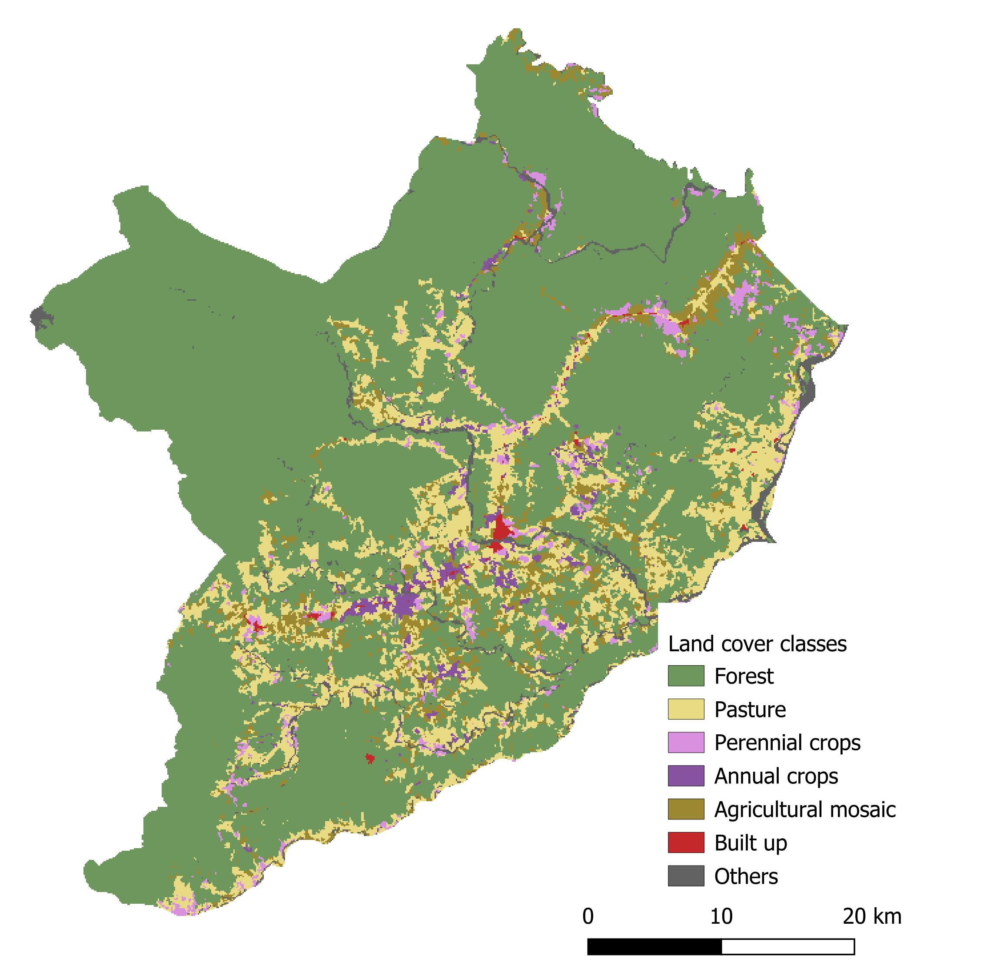

# Tutorial for usage of CLUMondoPy with test data from Canton Loreto, Ecuador

## Overview

This tutorial offers a way for potential users of CLUinPy to test the script with some test data. This data includes different raster (`.tif`) and tabular (`.xlsx`) data. Raster files include a land cover map, location of protected areas (restriction zones) and predictor variables. Additionally, we also provide an already calculated suitability stack, but users may calculate suitability also on their own with the suitability module. Tabular data include scenario settings such as demand and land use service matrices. We provide two sets for different scenarios and a configuration `.txt` file for each one.

## Test data site background

We use the Canton Loreto district in Ecuador as a case study area for our test data. Loreto is located in the Western part of the Ecuadorian Amazon and has experienced high dynamics in land use change over the past decades. [ Lippe et al. 2022](https://www.sciencedirect.com/science/article/pii/S0264837722002344) have projected land use change in Loreto until 2030 with DynaCLUE. Hence, for more context on the study area we kindly refer to this paper.

*Figure 1. Land cover map of Loreto canton for the year 2016 (figure created by S. Thomsen 2026).*

## Data

The following raster data is provided:

<!-- TODO: Insert a figure showing example rasters / layers here -->

| Raster file name | Description | Source | Download link/ Data source | Comment |
|---|---|---|---|---|
| `lc2016.tif` | Land cover map for 2016 | MAE | http://mapainteractivo.ambiente.gob.ec/ | Online access no longer avaialable |
| `protected_areas_nacionales.tif` | Binary map of national protected areas | MapBiomas Ecuador | https://storage.googleapis.com/mapbiomas-workspace/TERRITORIES/INDEXED/ECUADOR/WORKSPACE/PROTECTED_AREAS_NACIONALES/PROTECTED_AREAS_NACIONALES_v2.zip |  |
| `aspect.tif` | Compass direction of the downhill slope (0-360°) | Farr et al. (2007); SRTM | GEE Asset ID: `USGS/SRTMGL1_003` |  |
| `dist_city.tif` | Euclidean distance to the nearest parish capital | Lippe et al. 2022 |  |  |
| `dist_highway.tif` | Euclidean distance to the national highway E20 | Lippe et al. 2022 |  |  |
| `dist_oilfield.tif` | Euclidean distance to the nearest oilfield | Lippe et al. 2022 |  |  |
| `dist_pfo.tif` | Euclidean distance to the province capital Puerto Francisco de Orellana | Lippe et al. 2022 |  |  |
| `dist_river.tif` | Euclidean distance to the nearest river | Lippe et al. 2022 |  |  |
| `dist_road.tif` | Euclidean distance to the nearest road | Lippe et al. 2022 |  |  |
| `elevation.tif` | Metres above sea level | Farr et al. (2007); SRTM | GEE Asset ID: `USGS/SRTMGL1_003` |  |
| `entisols.tif` | Presence/absence of soil type Entisol | MAGAP | http://geoportal.magap.gob.ec/inventario.html | Online access no longer avaialable |
| `inceptisols.tif` | Presence/absence of soil type Inceptisol | MAGAP | http://geoportal.magap.gob.ec/inventario.html | Online access no longer avaialable |
| `ntli2013.tif` | Intensity of stable Night Time Lights in 2013 (digital number values from 0-63) | NOAA | GEE Asset ID: `NOAA/DMSP-OLS/CALIBRATED_LIGHTS_V4` |  |
| `popdens_unadj.tif` | Number of people per hectare in 2010 | Worldpop | www.worldpop.org |  |
| `precipitation.tif` | Mean annual precipitation (mm/year) | MAGAP | http://geoportal.magap.gob.ec/inventario.html | Online access no longer avaialable |
| `slope.tif` | Slope (°) | Farr et al. (2007); SRTM | GEE Asset ID: `USGS/SRTMGL1_003` |  |

The `lc2016.tif` file serves as the initial land cover map for our scenario modelling in CLUMondoPy. The `protected_areas_nacionales.tif` file indicates areas which should not undergo change during the scenario modelling (restricted areas). All other `*.tif` files are predictor variables for suitability calculation.

### Land cover classes in `lc2016.tif`

<!-- TODO: Insert a legend graphic for land cover classes here -->

| Class ID | Description |
|---:|---|
| 0 | Forest |
| 1 | Pasture |
| 2 | Perennial crops |
| 3 | Annual crops |
| 4 | Agricultural mosaic |
| 5 | Build-up (urban) |
| 6 | Other (including water) |

## Scenario parameters

Users can adjust different data and parameters in CLUinPy in order to calculate scenarios. This test data tutorial contains two scenario sets. Both sets contain the same files that are briefly summarized below:

| File name | Description                                                                                                                                                                                                                                                                   |
|---|-------------------------------------------------------------------------------------------------------------------------------------------------------------------------------------------------------------------------------------------------------------------------------|
| `Demand.xlsx` | Land service demand for each time step (year)                                                                                                                                                                                                                                 |
| `Allow.xlsx` | Which class wise land cover transitions are allowed                                                                                                                                                                                                                           |
| `Lus_matrix.xlsx` | Indicates, how many units of land service can be provided per pixel and land cover class                                                                                                                                                                                      |
| `Lus_conv.xlsx` | Indicates the conversion order of land cover classes per demand. Higher values indicate prioritization in conversion. For more details, please refer to the original [CLUMondo manual](https://dataverse.nl/file.xhtml?fileId=408508&version=1.0).                            |
| `Config*.txt` | Contains relevant remaining parameters for scenario calculation and can be called as the only argument to the `runCLUMondoPy.py` file. A detailed description of all parameters in the configuration file can be found in the [manual](CLUinPy_manual.md) in this repository. |

The core innovation of CLUMondo over its predecessors (DynaCLUE, CLUE-S) is its ability to model multifunctional landscapes. This can be expressed in the model in the land service matrix (`lus_matrix.xlsx`) and land conversion matrix (`lus_conv.xlsx`). In the land service matrix, one can indicate that a particular land cover class can provide several services at once. Consequently, this is also reflected in the land conversion matrix, where users can define the priority order of land cover classes for each demanded service, in case it is provided by several classes.

In this example, we provide a **single functionality scenario (scenario 1)**, in which we define demands for cattle, perennial crops, annual crops and mixed agriculture. These services are fulfilled by only one class each (pasture, perennial, annual and agricultural mosaic). For the **scenario 2**, we implemented **multifunctionality** by not defining specific demands for mixed agriculture, but defining that the class agricultural mosaic can partly fulfil three services (cattle, perennial crops and annual crops). Therefore, the class agricultural mosaic can compete with the other providing classes during the allocation process.

## How to run the scenarios?

First, please install all necessary packages (see `requirements.txt`).

### Suitability (optionally)

You may want to calculate location suitability for the land cover classes yourself. For this, you can run the `run_suitability.py` script in the scripts module. You may want to adapt or change file paths in the script and adjust parameters to your preference. For further details on parameters please refer to the [suitability module manual](suitability_manual.md) in the repository.

### CLUinPy (land use model)

To run one of the scenarios in CLUinPy, you need to run the `run_CLUinPy.py` script from the Scripts module and call the `config*.txt` files as the only argument. Please refer to the [ReadMe](../README.md) and [manual](CLUinPy_manual.md) in this repository for further information on how to run CLUinPy with configuration txt files.

For visualization of the resulting land cover map projections in QGIS, you can use the `land_cover_visualization.qml` file.
